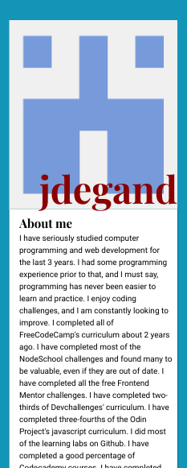

# Odin Project - Advanced HTML and CSS - Personal Portfolio

## Table of contents

- [Overview](#overview)
  - [Screenshot](#screenshot)
  - [Links](#links)
- [My process](#my-process)
  - [Built with](#built-with)
  - [Continued development](#continued-development)
  - [Useful resources](#useful-resources)

## Overview

Solution for a challenge from the [Odin Project](https://web.archive.org/web/20220525212002/https://www.theodinproject.com/lessons/node-path-advanced-html-and-css-personal-portfolio).  

### Screenshot

### Links

- [Live Link](https://jdegand.github.io/odin-project-personal-portfolio)

## My process

### Built with

- HTML
- CSS
- JavaScript
- [Github API](https://docs.github.com/en/rest?apiVersion=2022-11-28)

## Continued development

- Better contact section
- Add topics to Github repos and then map over the topics in the Javascript
- Font change (the fonts they used don't really work best here).
- The Github API has weird quirks. Some repos that have been updated don't reflect that, i.e., `cssbattle` repo, etc.
- You could use EmailJs to get emails from visitors and add a form in the contact section. It's not hard to implement, but it will expose data and your email could get spammed.
- The loading div is small, so the main body collapses. Rework by having a div wrap the loading div with a set height. The loading div could be positioned absolutely in the center. Change the JS to hide the wrapper div instead of the loading div.
- Disabling the next page button depends on a hardcoded value. It has to be updated when I surpass the maximum number of repos.

## Useful Resources

- [Beta Metrics](https://beta-metrics.lecoq.io/insights?user=jdegand) - Beta Github Metrics
- [Metrics](https://metrics.lecoq.io/insights?user=jdegand) - Github Metrics (The site has had issues of late)
- [YouTube](https://www.youtube.com/watch?v=FiGynIW0wsQ) - Consuming Github Users Api with React
- [YouTube](https://www.youtube.com/watch?v=f4D50VnO_Gw) - Vanilla JavaScript display API data
- [Codepen](https://codepen.io/mandelid/pen/kNBYLJ) - CSS spinner
- [Thoughtco](https://www.thoughtco.com/wrapping-text-around-image-3466530) - wrap text around an image
- [Stack Overflow](https://stackoverflow.com/questions/39318043/github-users-api-paging-not-work) - github users api pagination
- [Stack Overflow](https://stackoverflow.com/questions/29130778/irregular-shape-background-css) - irregular shaped background with css
- [Blog](https://www.falldowngoboone.com/blog/tips-for-vanilla-javascript-dom-manipulation/) - vanilla js dom manipulation
- [Geeks for Geeks](https://www.geeksforgeeks.org/how-to-wrap-the-text-around-an-image-using-html-and-css/) - wrap text around an image
